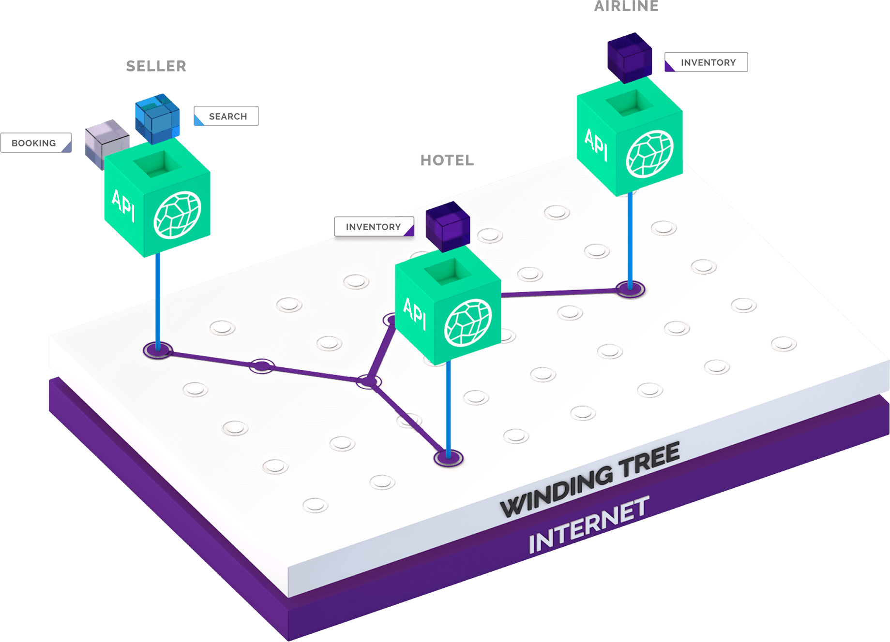
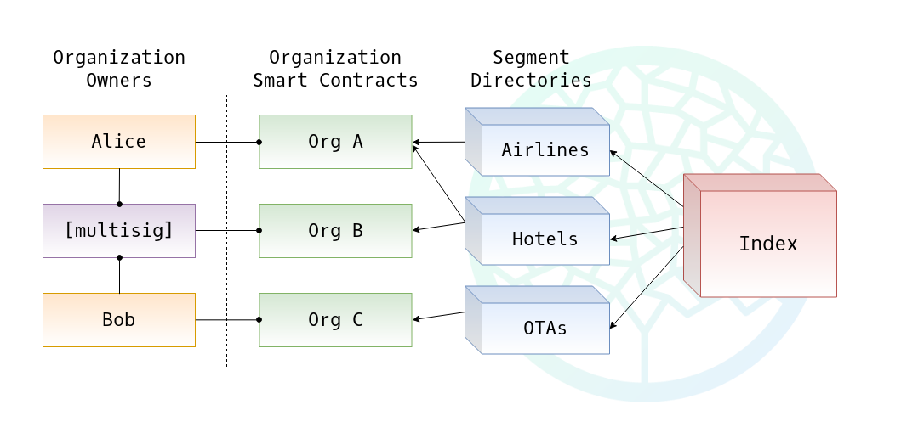

# Winding Tree Platform Overview

Winding Tree is a marketplace for travel companies. It is an open-source ecosystem of interoperable API standards and harmonized data structures enabling decentralized distribution and discovery of travel products and services.

Winding Tree uses a variety of open technologies, including Ethereum blockchain.

If you are already familiar with Winding Tree, feel free to skip to the [documentation](getting-started.md).

## Who is It For?

Winding Tree is a completely decentralized platform (like the Internet) where **travel suppliers** (hotels, airlines, car rentals, insurance providers, etc.) can showcase their products and services without a need to go through an intermediary. And, of course, where **travel agencies and travel management companies** can access those products and purchase them.

Because the platform is open-source, we foresee that new products and services will be added to it soon. Are you an **insurance company** or **provider of security information**? Why not offer your products to OTAs and TMCs through the platform? Are you a new OTA? Gain competitive advantage by accessing inventory you could not access before.

## Why Decentralization Matters?

Current intermediaries in the travel industry don't just charge unnecessarily large fees, they also act as gatekeepers of the industry, picking and choosing companies and ideas that will have access to the marketplace. Because there are just few intermediaries, they also don't have any incentive to update their technology stack, that's why travel tech is so out of date. (To better understand this issue, we recommend reading [The Master Switch](https://www.goodreads.com/book/show/8201080-the-master-switch) by Tim Wu.)

## What Winding Tree is Not

Winding Tree is not a website for booking travel, nor we're a PMS or PSS (although we've created examples of how these systems can be integrated or built on top of the platform). **Winding Tree is just a set of protocols and conventions!**

## What Does Winding Tree Do?

Winding Tree is designed to provide two key features that any marketplace requires: aggregation and trust.

### Aggregation

There are thousands of travel companies out there and it's important to have one database of these companies in one place. That's why current intermediaries are so powerful, not because they have great technology.

### Trust

As a supplier, you want to control who can access your inventory. As an OTA, you want to be sure that the hotel you're booking for your customer exists. Winding Tree Protocol defines a few simple rules that help both buyers and sellers to establish trust in each other, all in a completely decentralized manner.

## How Does Winding Tree Work?

Winding Tree architecture has several layers:

- Organization ID smart contracts
- Segment Directory smart contracts
- The Index smart contract

This design allows for suppliers to be easily discovered by potential buyers of their products and services. In addition to that, each organization is required to list one or more public keys in their smart contract and sign all their API calls and responses with the corresponded private keys, which clearly identifies the parties. Think of it as DNS + ID system.

## Use-Cases

### Distribution

The distribution use-case is covered in the example above. An OTA can easily access inventory from many companies. What else can be done on top of the platform?

### Settlement

Because all the API calls between market participants are signed with their keys, both companies have unfalsifiable proof of these transactions. E.g. the hotel has a record of the OTA owing them a certain amount of money. At the same time the OTA has evidence that the hotel has to provide rooms for the OTA customers.

### Trust Building

Now, let's imagine that the OTA, in order to access the hotel inventory, had to go through a rigorous vetting process with the hotel account manager. (After all, supplier should have full control over their inventory.) But after some time doing business with the hotel, the OTA has cryptographic proof that they do business with that hotel. They can use that information (stripped of any personal data) to prove to another hotel that they are a company in good standing.
