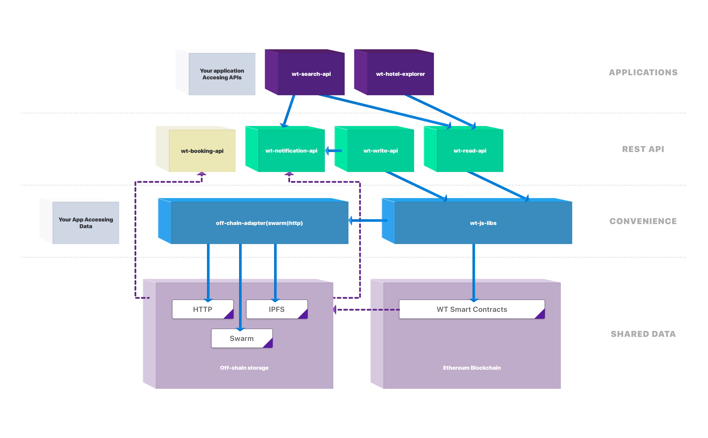

# Getting started with Winding Tree

Winding Tree platform is an open-source ecosystem of interoperable API standards and harmonized data structures enabling decentralized distribution and discovery of travel products on top of Ethereum blockchain, distributed databases and web technologies.

Winding Tree core team maintains [reference open-source implementation of API Servers](/tooling.md) you can run yourself for convenience access to the platform data in the [runtime environments](/tutorials/how-to-pick-environment.md).

**Learn more**

* [How to Publish Inventory Listing](/tutorials/how-to-publish-inventory.md)
* [How to Query Listings](/tutorials/how-to-retrieve-inventory.md)
* [How to Book Accommodation](/tutorials/booking-stay.md)

## Platform Functionality

* [Publishing](https://developers.windingtree.com/apis/wt-write-api.html#/default/post_hotels), [retreiving](https://developers.windingtree.com/apis/wt-read-api.html#/default/get_hotels__hotelId_) and [updating](https://developers.windingtree.com/apis/wt-write-api.html#/default/patch_hotels__hotelAddress_) accomodation provider details, inventory and availability
* [Booking](https://developers.windingtree.com/apis/wt-booking-api.html#/default/post_booking) accommodation products
* [Querying](https://developers.windingtree.com/apis/wt-search-api.html#/default/get_hotels) accommodation by geolocation
* [Subscribing](https://developers.windingtree.com/apis/wt-notification-api.html#/default/post_subscriptions) to the event stream and listening to the data updates in the platform

## Architectural Overview

For a more technical deep dive, head to our [wiki](https://github.com/windingtree/wiki).

