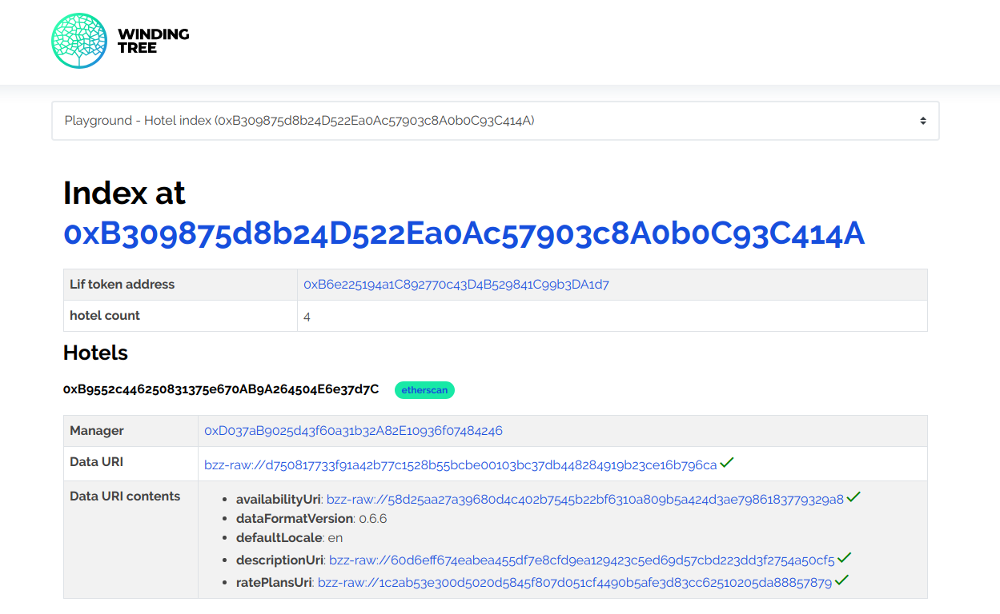

# How to verify published data

So you have [published your data](how-to-publish-inventory.md), but you have
no idea if it looks like you wanted. In this tutorial, you will learn which
tools you can use to verify that your data got published properly and that
other Winding Tree ecosystem participants are able to reach them.

## Requirements

- Blockchain address of a [published inventory](how-to-publish-inventory.md).

## Step by step

### Index Debugger

[The Index debugger](http://index-debugger.windingtree.com) is communicating
directly with the deployed smart contracts and off-chain data where possible.
Internally, it is using our [Javascript library](https://github.com/windingtree/wt-js-libs)
and our own [Swarm gateway](https://swarm.windingtree.com). It let's you very
quickly see where your current data is located and whether it is accessible.

The Index Debugger does not check for the semantics of the data, only if it can
be reached by other tooling. It might be handy to check if your data is still
available over the Swarm network.



### Read API

You can use an instance of [Read API](../apis.md) connected to the same Winding
Tree index as Write API that you used to publish the data. You can check which
index the API is using on its root endpoint.

Read API offers you one additional check - it validates the semantics of the data
against our data model and either returns an error code or a warning header if
you try to access data that is somehow considered invalid by the API. This is
useful to check if you are also publishing your data with the currently used
`dataFormatVersion`.

```sh
$ curl https://playground-api.windingtree.com/hotels/0xFb3d909b63F119Add7cde4b995a3C9D03b4F87a7 

{
   "short" : "Validation did not pass.",
   "data" : {
      "currency" : "RON",
      "updatedAt" : "2019-03-01T08:36:58.006Z",
      "name" : "Hostel Marilena",
      "dataFormatVersion" : "0.4.0",
      "amenities" : [
         "vending machine",
         "laundromat"
      ],
      "description" : "Cheap accomodation in Dragolm for anyone. Good connection with city centre via public transport. Cyclicsts, backpackers welcome. Reception is open 24/7.",
      "id" : "0xFb3d909b63F119Add7cde4b995a3C9D03b4F87a7",
      "images" : [
         "building1.jpg",
         "building2.jpg",
         "laundromat.jpg"
      ],
      "address" : {
         "city" : "Dragolm",
         "line2" : "",
         "postalCode" : "33200",
         "country" : "RO",
         "line1" : "Horse Saddle 34"
      },
      "location" : {
         "latitude" : 45.9348412,
         "longitude" : 24.012348
      },
      "contacts" : {
         "general" : {
            "url" : "https://geotowns.ro/marilena",
            "email" : "info@marilena.ro",
            "phone" : "+359895242586"
         }
      }
   },
   "long" : "Unsupported data format version 0.4.0. Supported versions: 0.6.0",
   "code" : "#validationFailed",
   "status" : 422
}
```
