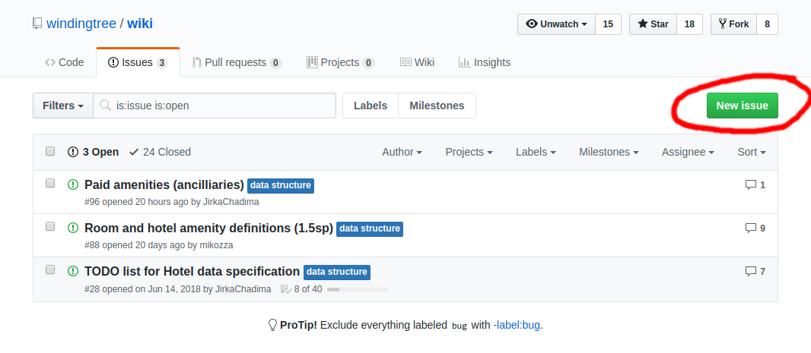

# How to propose a change?

Are you missing something in the Winding Tree ecosystem? The data model
does not cover everything you need? In this article, you will learn,
how to reach to us and propose a change.

## Step by step

All of our code is open sourced and publicly available on [GitHub](https://github.com/windingtree).
Both [data model](../data-model.md) and [API specifications](../apis.md) are
in [OpenAPI Specification](https://swagger.io/specification/) format.

We are definitely open to all alterations, suggestions and improvements
and the right place for them is on GitHub where everybody can join
the discussion.

### Locating the proper place

The work on GitHub is separated in repositories. And each
repository contains a specific part of the ecosystem. The first
step in proposing a change is in locating the appropriate repository.

- Data model: [https://github.com/windingtree/wiki](https://github.com/windingtree/wiki)
- API specifications: See the [tooling page](../tooling.md). Every API
specification is located next to our reference implementation of said API.

You will need a [GitHub account](https://help.github.com/en/articles/signing-up-for-a-new-github-account)
for this - but you don't need any paid plan.

### Filing an issue

Every repository on GitHub has a section called *Issues*, where everybody
(including you!) can raise their voice and propose a change. So if
you feel that something is missing or can be improved, open an Issue
in the respective repository and somebody will respond eventually.

Issues are also a good place for alterations that are not clear or require
some more research or deeper discussion, for example.

*Hit the New Issue button to create an issue*

### Sending a change

If you are pretty sure what you would like to change and are willing to go
hands deep, there's always an option of opening up a Pull Request.

The easier way is to use GitHub directly and create a Pull Request online.

1. Navigate to the file where you want to make a change. For example the
data model for Hotel part of the platform is [here](https://github.com/windingtree/wiki/blob/master/hotel-data-swagger.yaml).
2. Follow [this excellent guide](https://help.github.com/en/articles/editing-files-in-another-users-repository).

If you are more experienced with coding or GitHub, you can follow the usual
routine of **Fork-Update-Send PR**. If you are not familiar with GitHub per se,
there [are](https://gist.github.com/Chaser324/ce0505fbed06b947d962)
[many](https://www.codenewbie.org/blogs/how-to-make-a-pull-request) helpful
tutorials around.
